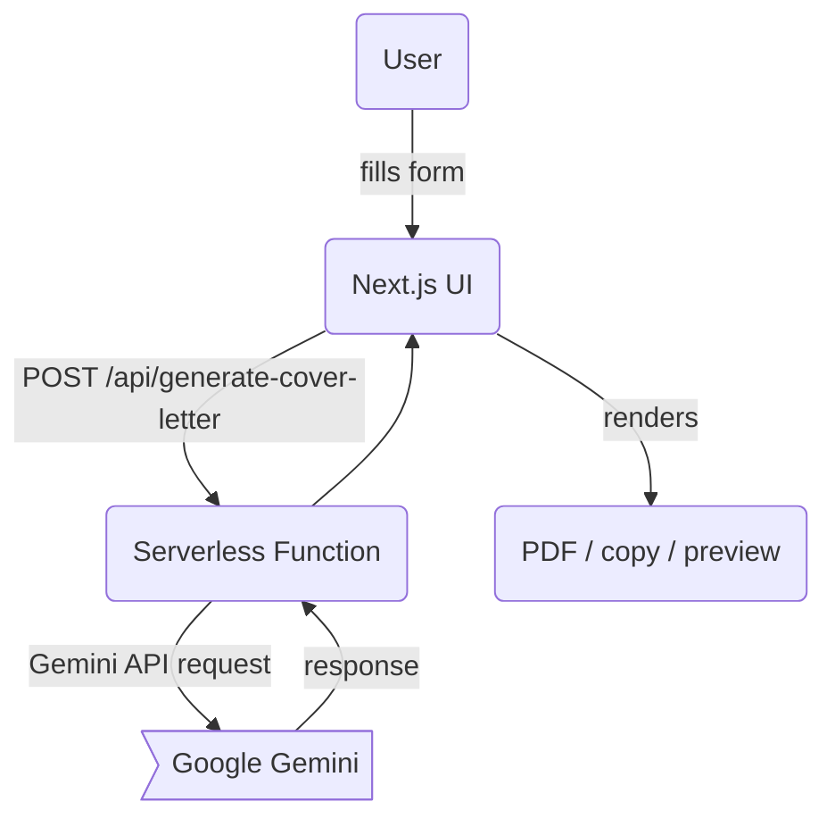

# Run and deploy your AI Studio app

This contains everything you need to run your app locally.

## Run Locally

**Prerequisites:**  Node.js


<!-- @import "[TOC]" {cmd="toc" depthFrom=1 depthTo=6 orderedList=false} -->

1. Install dependencies:
   `npm install`
2. Set the `GEMINI_API_KEY` in [.env.local](.env.local) to your Gemini API key
3. Run the app:
   `npm run dev`

---

## 🌐 Deploy to Production

This project is ready-to-deploy on two popular platforms: **Vercel** (recommended for Next.js) and **Netlify** (already used for the serverless function in `/netlify/functions`).  Pick whichever service you are most comfortable with – the codebase contains config for both.

| Platform | Why choose it? | One-click guide |
|----------|----------------|-----------------|
| **Vercel** | Native Next.js support, automatic image optimisation, instant rollbacks | [](https://vercel.com/import/project?template=https://github.com/your-username/AI-Personalized-Cover-Letter) |
| **Netlify** | Excellent free tier, built-in edge functions (used here), simple environment variable UI | [](https://app.netlify.com/start/deploy?repository=https://github.com/your-username/AI-Personalized-Cover-Letter) |

### Manual Steps (works for **any** host)

1. **Build the app**  
   ```bash
   npm run build   # next build
   ```
2. **Expose environment variables**  
   Create the following on your hosting provider (or in `.env.production` if self-hosting):
   ```env
   GEMINI_API_KEY      = <your-google-gemini-api-key>
   BASE_URL           = https://your-chosen-domain.com   # optional, but nice for canonical URLs
   ```
3. **Serverless function**  
   • Netlify detects `/netlify/functions` automatically.  
   • On Vercel, rename the folder to `/api` **or** create an API route in `pages/api` that calls the same logic.
4. **Deploy**  
   Commit & push – the CI on your platform will take care of the rest.

### Why these steps?

* **Environment variables** keep your API key secure and out of the client bundle.
* **Serverless functions** mean the heavy-lifting (Gemini request) runs on the server, not the browser – protecting your key and avoiding CORS headaches.
* The **build step** ensures your Tailwind CSS is purged and pages are statically optimised for blazing-fast loads.

### TL;DR for Beginners

```bash
# 1. Fork the repo
# 2. Click the deploy-button above (Vercel or Netlify)
# 3. Add your GEMINI_API_KEY when prompted
# 4. Wait for the build to finish (~1-2 min)
# 5. Open the generated URL and start generating cover letters 🎉
```

---

## 🗺️  Project Flow (Mermaid)

See `docs/flow.mmd` for a full diagram of how a request travels through the app.  Render it locally with a VS Code mermaid extension or online at [Mermaid Live Editor](https://mermaid.live).



---

## Author

Created by [@kwagle](https://linkedin.com/in/kwagle) – Kshitij Wagle

---

## 📖  Additional Resources

* **docs/flow.mmd** – full architecture diagram  
* **netlify/functions** – serverless source code  
* **pages/api** – optional Vercel-style API route (add if you choose Vercel)  
* **tailwind.config.js** – customise your design system

Happy shipping! 🚀
